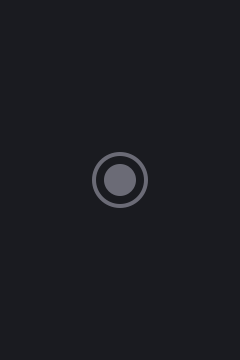

# CineFolio

<div align="center">
  
  <p><strong>A premium movie discovery tool. Built for Jeevan — Hardik Garg.</strong></p>
</div>

## Project Overview

CineFolio is an elegant, immersive, and fast movie discovery application. Built as an internship submission, it exceeds standard functional requirements by introducing a streaming-platform-grade UX featuring cinematic gradients, buttery-smooth Framer Motion interactions, and robust error/loading state management.

## Key Features
- **Premium Discovery:** Browse popular movies through a highly polished UI with dynamic backdrop immersion.
- **Instant Search:** Debounced, accessible search bar that seamlessly routes and fetches via the TMDB API.
- **Favorites Persistence:** Client-side local storage safely hydrated to prevent React SSR mismatch errors.
- **Strict 12-Item Pagination:** Custom mathematical slicing of TMDB's 20-item pages ensures exactly 12 items are rendered per page to strictly comply with the assignment parameters.
- **Immersive Details:** Rich metadata parsing including runtime, localized genres, vote counts, popularity metrics, and tagline presentation.

## Tech Stack
- **Framework:** Next.js 15 (App Router, Server Components)
- **Language:** TypeScript (Strict Mode)
- **Styling:** Tailwind CSS (Custom Base Tokens, no default palettes)
- **Animation:** Framer Motion
- **Icons:** Lucide React
- **API:** TMDB (The Movie Database)

## Architecture Notes
- **Suspense Boundaries:** Critical client components utilizing `useSearchParams` are deeply wrapped in `<Suspense>` to ensure the Next.js static builder can aggressively optimize the rest of the application.
- **Data Normalization:** Raw TMDB types are mapped heavily via `normalizeMovie` to isolate the UI components from external schema changes.

## Running Locally

### 1. Installation
Clone the repository and install dependencies:
```bash
npm install
```

### 2. Environment Variables
You will need a valid TMDB API key. Create a `.env.local` file at the root:
```env
NEXT_PUBLIC_TMDB_API_KEY=your_api_key_here
```

### 3. Start Development Server
```bash
npm run dev
```
Open [http://localhost:3000](http://localhost:3000) in your browser.

## Assignment Compliance
- [x] Next.js
- [x] TMDB Integration
- [x] Browse, Search, Favorites
- [x] Exact 12 items per page manually paginated
- [x] Standard `/movie/[id]` route structure
- [x] Footer text exact match
- [x] Strict visual token matching

## Future Improvements
- **Internationalization (i18n):** Allowing users to swap languages.
- **Trailer Support:** Integrating YouTube iframes fetched from TMDB's video endpoints.
- **Authentication:** Migrating from localStorage to a robust database (e.g. Supabase) for cross-device favorites sync.
